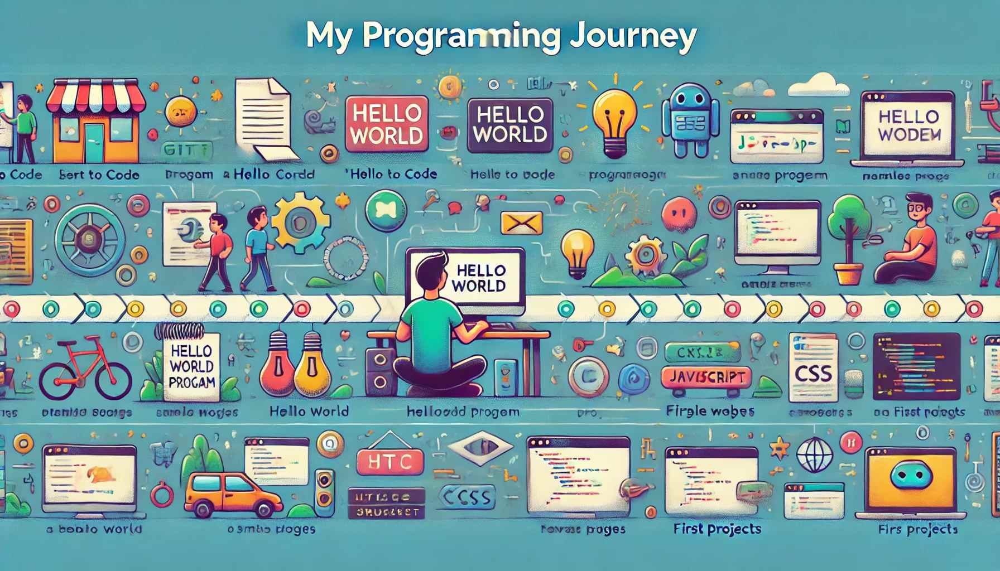

# Hey there, I'm Rob! 👋

 <!-- Optional: Add a cool banner image -->

Welcome to my GitHub profile! I'm a high school student passionate about web programming and eager to learn and grow in the tech world. 

## About Me

- 🌱 I'm currently learning full-stack web development.
- 👨‍💻 I love creating websites and web applications.
- 💡 I'm fascinated by how the web connects people and ideas.

## My Skills

- **Languages:** HTML, CSS, JavaScript
- **Tools & Platforms:** Git, GitHub

## Projects

No projects yet... I'm learning.

## Fun Facts

- 🚀 I'm a big fan of space exploration.
- 🎮 I enjoy playing video games in my free time.
- 📚 I love reading about new tech trends and innovations.
